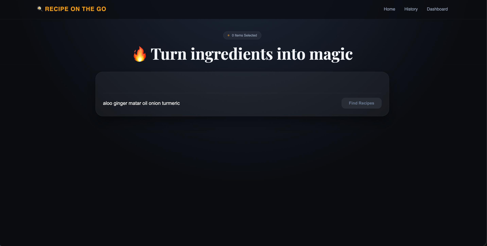
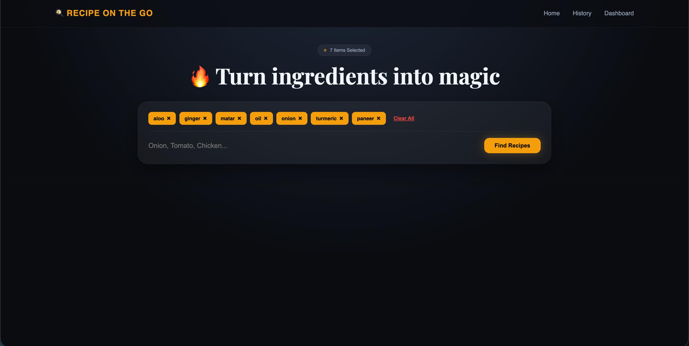
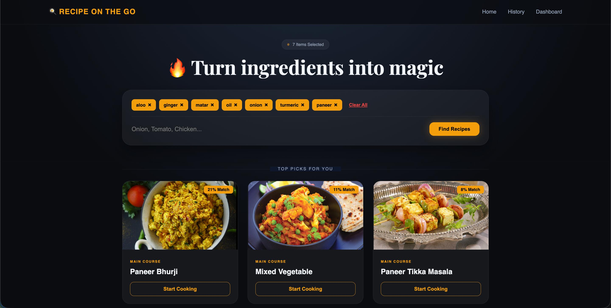
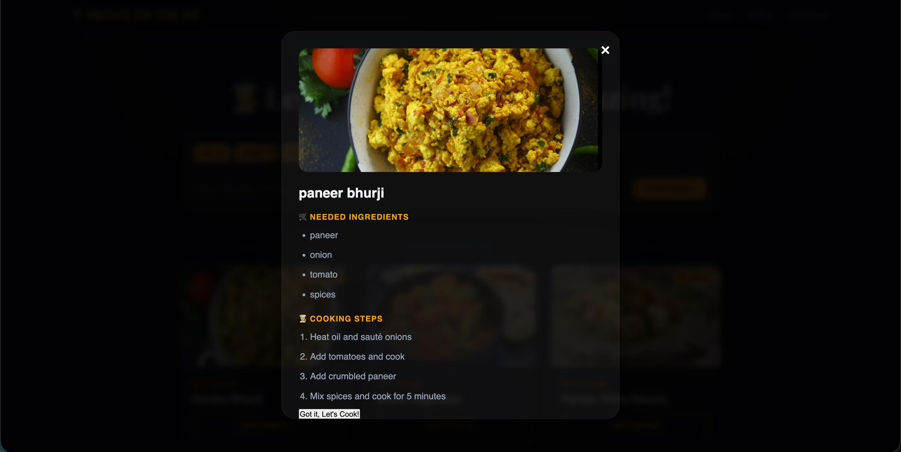
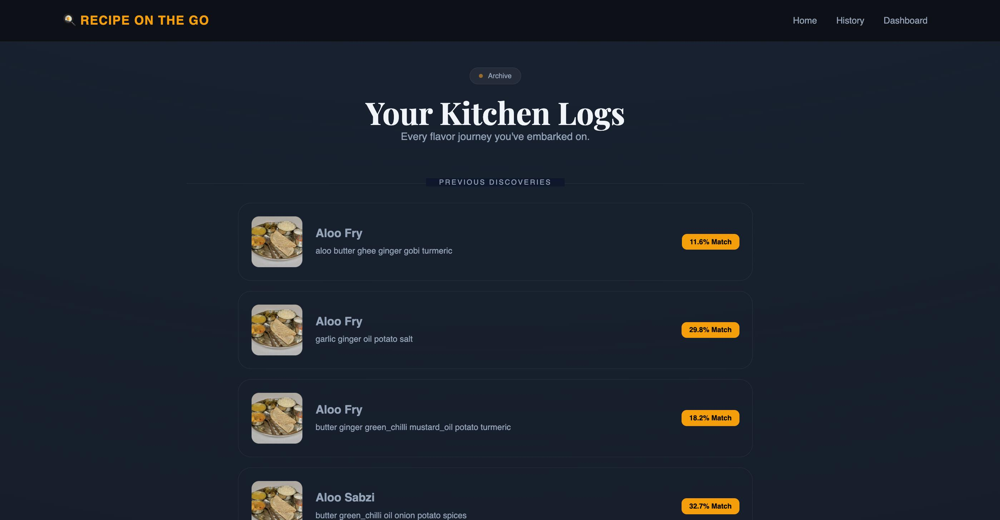
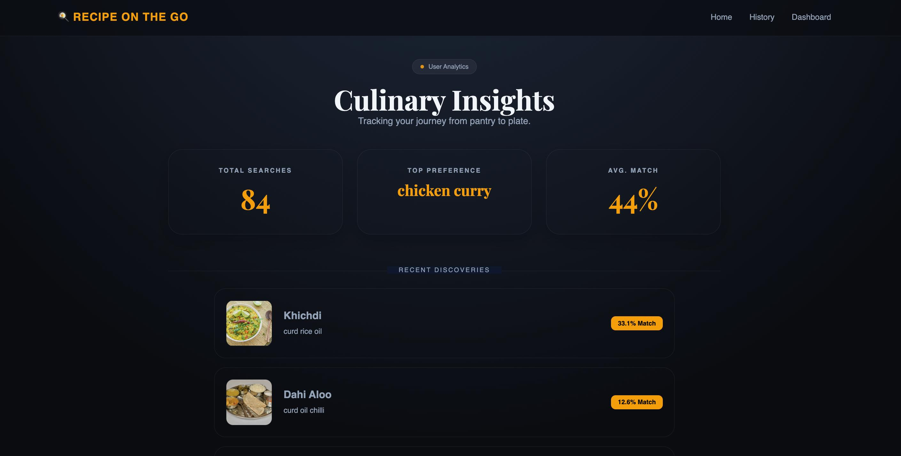
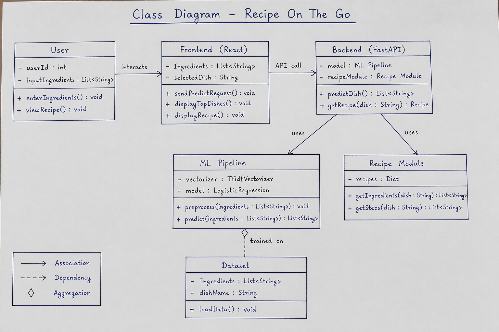
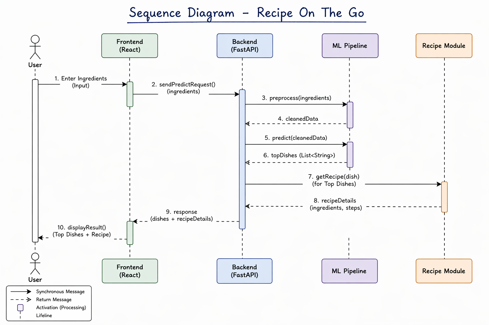
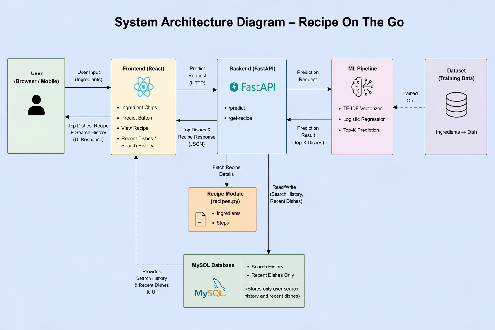

# 🍽️ Recipe On The Go (Full Stack AI App)

A full-stack AI-powered recipe recommendation system that predicts dishes based on user-provided ingredients and provides detailed cooking steps.

---

# 🎓 Academic Project

📌 **Major Project (MCA 4th Semester)**
🏫 Harcourt Butler Technical University (HBTU), Kanpur

---

# 🚀 Live Demo

* 🌐 **Frontend (Vercel)**: https://recipe-on-admroc7hu-harsh56845s-projects.vercel.app/
* ⚙️ **Backend (Railway)**: https://recipeongo-production.up.railway.app
* 📘 **API Docs**: https://recipeongo-production.up.railway.app/docs

---

# 📸 Screenshots

## 🏠 Home Page



## 🔍 Dish Input & Search



## 🍽️ Prediction Result



## 📖 Recipe Details



## 🕓 Search History



## 🎨 UI View



---

# 📊 Project Diagrams

## 🧩 Class Diagram



## 🔄 Sequence Diagram



## 🏗️ System Architecture



---

# 🧠 Features

* 🔍 Predict dish from ingredients using AI model
* 📖 Get complete recipe (ingredients + steps)
* 🕓 Store and view search history
* ⚡ FastAPI backend with REST APIs
* 🎨 Interactive React UI (Vite)
* ☁️ Fully deployed (Vercel + Railway)

---

# 🏗️ Project Structure

```
Racipe-project/
│
├── backend/
├── recipe-frontend/
├── project_diagrams/
├── screenshots/
├── README.md
```

---

# ⚙️ Backend Setup (FastAPI)

```
cd backend
python -m venv venv
source venv/bin/activate   # Mac/Linux
pip install -r requirements.txt
uvicorn backend.main:app --reload
```

👉 Open: http://127.0.0.1:8000/docs

---

# 🎨 Frontend Setup

```
cd recipe-frontend
npm install
npm run dev
```

👉 Open: http://localhost:5173

---

# 🔗 Connect Frontend & Backend

Create `.env` in frontend:

```
VITE_API_URL=http://127.0.0.1:8000
```

---

# ☁️ Deployment

## Backend (Railway)

```
uvicorn backend.main:app --host 0.0.0.0 --port $PORT
```

## Frontend (Vercel)

```
VITE_API_URL=https://recipeongo-production.up.railway.app
```

---

# 🧑‍💻 Tech Stack

* Frontend: React (Vite)
* Backend: FastAPI
* Database: SQLite
* Deployment: Vercel + Railway
* AI/ML: TF-IDF / ML Model

---

# 👥 Team Members

* 👨‍💻 Harsh Vardhan
* 👩‍💻 Anshika Sharma
* 👨‍💻 Rajnarayan Yadav
* 👨‍💻 Saurabh Tiwari

---

# 🎯 Project Objective

To build an intelligent system that:

* Understands user ingredients
* Predicts relevant dishes
* Provides complete cooking guidance

---

# ⭐ Support

If you like this project, give it a ⭐ on GitHub!
